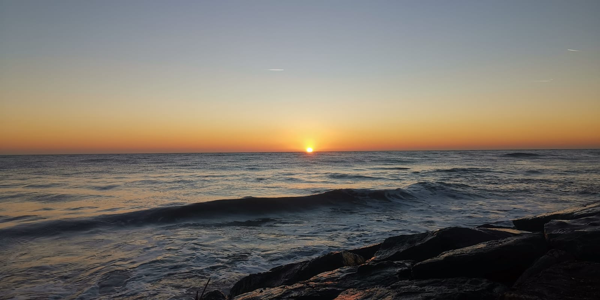
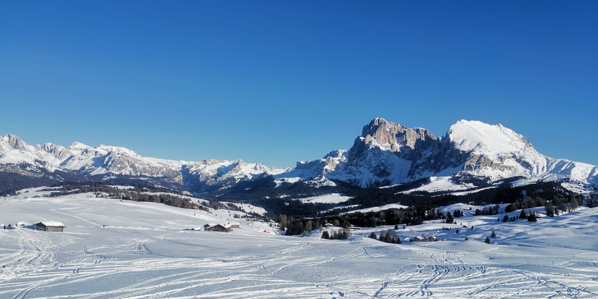

# About me

This is a blog where I'll be sharing my journey as a software engineering student.
I'm going to talk about courses, challenges, friends and also a bit about myself and my passions.
So if you care at all, stay tuned!

I'm a 22 year old from _Italy_ currently studying at Aalto University. I am part of the SECCLO- Security and Cloud Computing Master program.
I come from a small town in Italy near the beach, and I miss it very much (look at that sunset!).

I decided to become a computer science student because I love solving challenges and this allows me to do that every single day.
I moved to Finland to study and I like it very much here, even if the weather is definitely not as nice as in Italy!

In my free time, I love to travel, read and, whenever I can, I grab my skiis and I go skiing on the Alps.

That's it for now, see you all in one of the posts!
